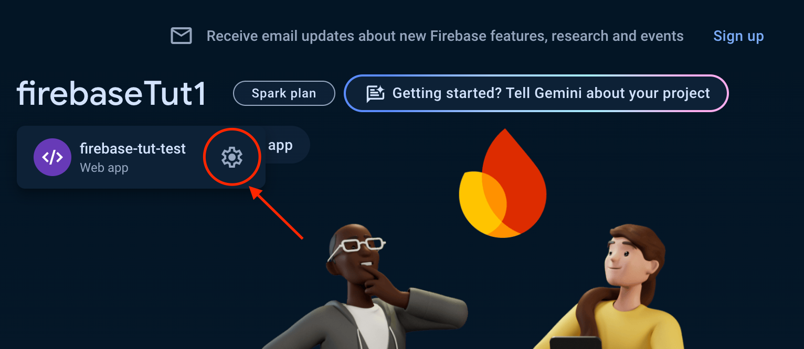
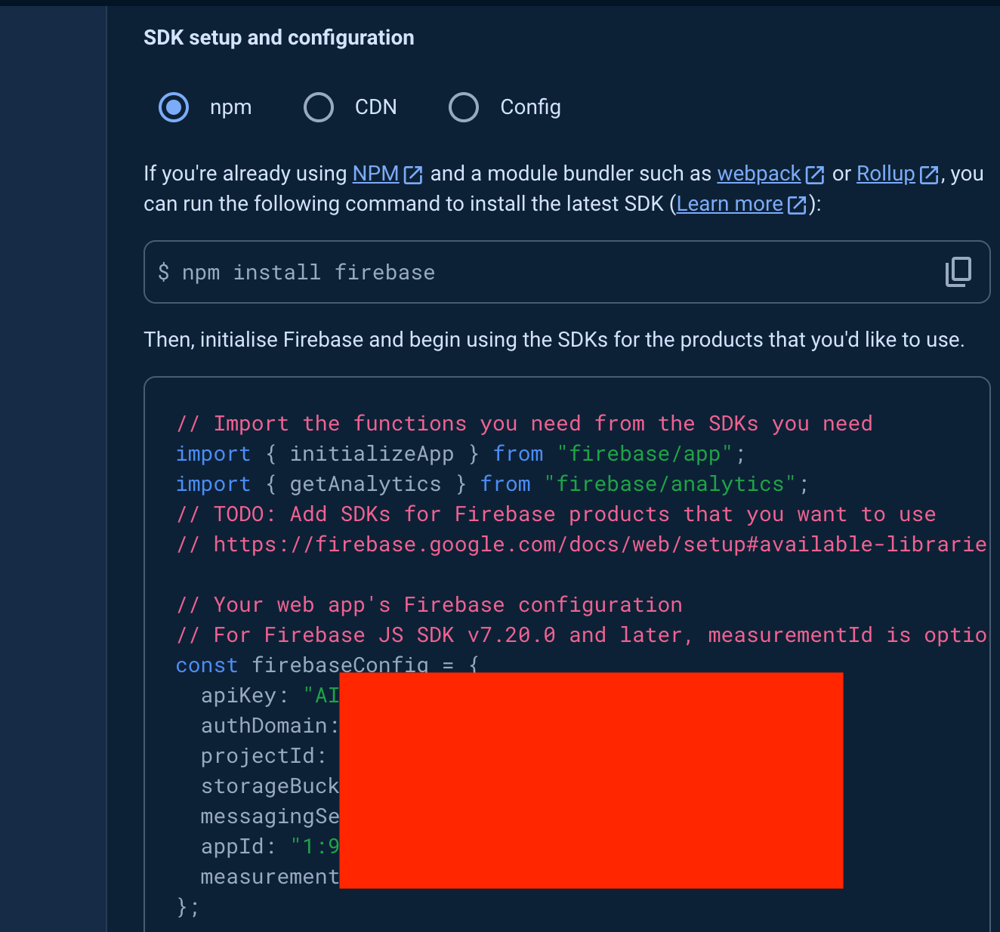

# Firebase Tut

## Tutorials for testing firebase

### 1. Create a react app

```bash
npx create-react-app firebasetut
```

### 2. Create a firebase project

Inside the react project folder, run the following command:

```bash
npm install firebase
```

### 3. Create a firebase project

Go to [Firebase Console](https://console.firebase.google.com/)
Click on `Add Project`
Enter the project name and click on `Continue`
Click on `Create Project`

### 4. Configure the firebase project



Click on the setting icon and scroll down to `SDK setup and configuration`



Copy the code and paste on to the `src/firebaseConfig.js` file
